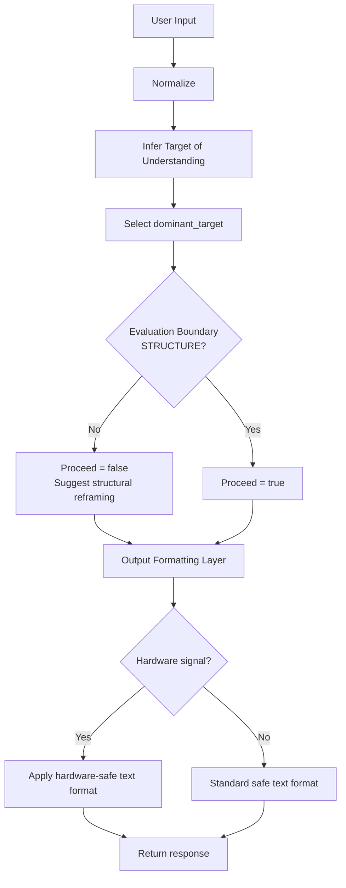

# Target of Understanding – Human-Centered AI Safety Portfolio

This repository demonstrates a **human-centered AI safety design**
that explicitly separates:

1. **Evaluation Boundary (Should the system proceed?)**
2. **Output Formatting Layer (How should the system respond safely?)**

This separation reflects a common safety principle in real-world AI systems:
**decision responsibility and expression responsibility should not be conflated.**

---

## Core Idea

Instead of labeling user emotion or intent, the system infers:

> **What the user is trying to understand (Target of Understanding)**

This signal is used to:

- decide whether reasoning should proceed
- decide how outputs should be formatted safely

Emotion and intent remain **implicit** and owned by the user.

---

## Targets of Understanding (examples)

- SELF
- OTHER
- RELATIONSHIP
- STRUCTURE
- FUTURE
- DECISION
- HARDWARE
- MEANING

Multiple hypotheses are kept internally with coarse confidence levels.

---

## Responsibility Separation

### 1. Evaluation Boundary (Model-side)

The evaluation boundary answers only one question:

> **Is the context structurally framed enough to proceed?**

Rule:

- If dominant target == STRUCTURE → proceed = true
- Else → proceed = false (suggest reframing)

This is **not correctness**, only framing adequacy.

---

### 2. Output Formatting Layer (Model-external)

Independently of the proceed decision, the system checks:

> **Does this context involve high-impact domains (e.g., HARDWARE)?**

If yes:

- enforce text-only output
- use confirmation-first, non-imperative language
- avoid autonomous action

This models AI-safety expression constraints outside the core reasoning loop.

---

## Execution Flow (GitHub-renderable Mermaid)

---

## Why This Matters for AI Safety

- Prevents premature personalization or blame
- Preserves user self-interpretation
- Makes safety decisions explicit and auditable
- Separates reasoning adequacy from expression constraints

---

## What This Is / Is Not

**This is:**

- A design-oriented AI safety portfolio
- A minimal, inspectable prototype
- A demonstration of responsibility separation

**This is not:**

- A production system
- An emotion classifier
- A psychological diagnostic tool
- An internal OpenAI implementation

---

## Conceptual Background

This work is grounded in prior conceptual essays on emotion and social structure:

https://medium.com/@shoppy_humanity/list/the-conceptual-model-might-be-basic-of-ai-safety-91e6486a4aa7

---

## Summary

- Evaluation Boundary decides **whether** to proceed
- Output Formatting decides **how** to respond safely
- Structural framing is a key safety gate
- High-impact domains require stricter expression constraints
